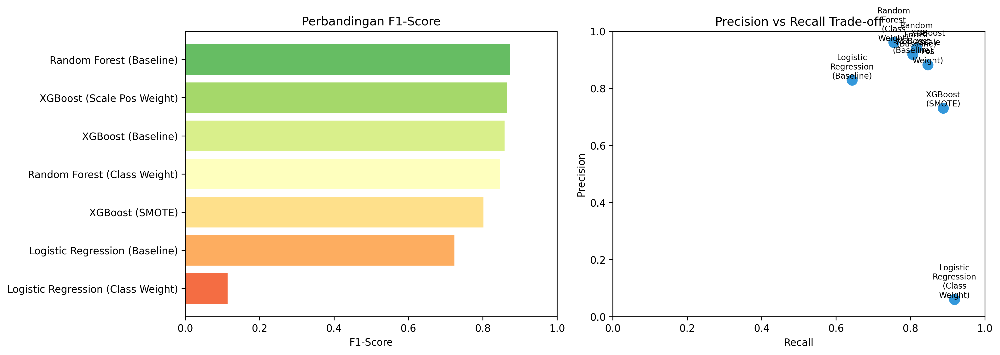
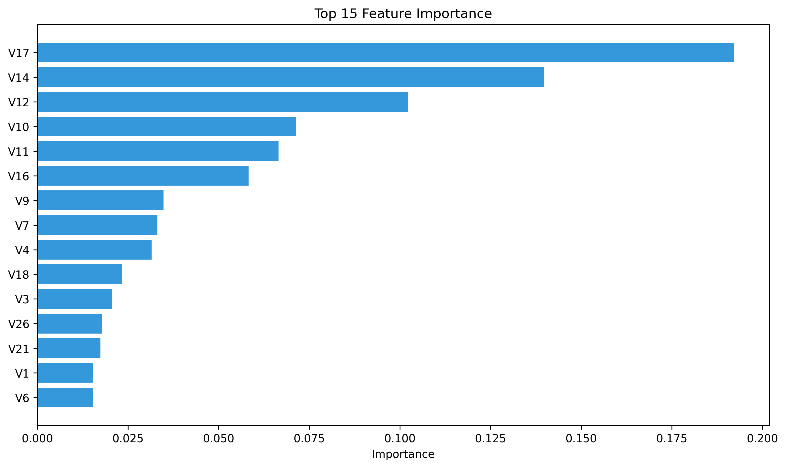
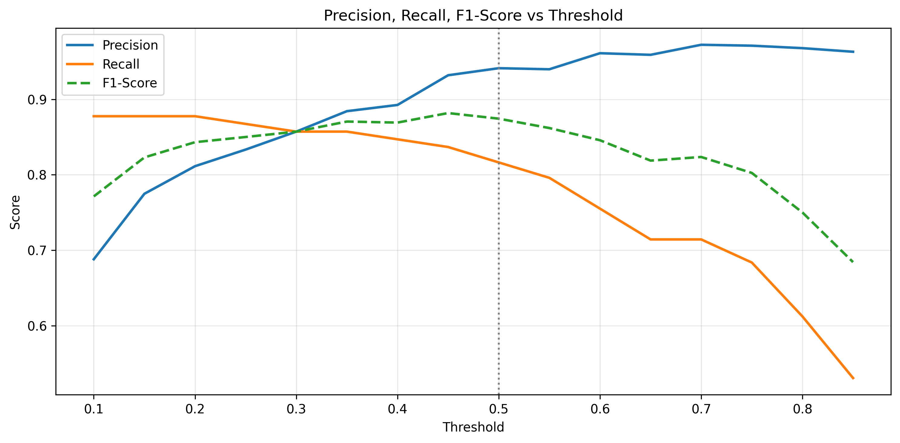
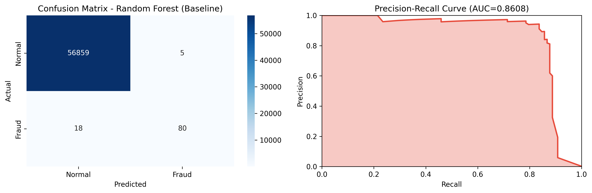

# 🔍 Credit Card Fraud Detection

Sistem deteksi fraud pada transaksi kartu kredit menggunakan Machine Learning. Proyek ini membangun model klasifikasi untuk mengidentifikasi transaksi yang mencurigakan dengan tingkat akurasi tinggi.

## 📊 Dataset

Dataset yang digunakan berasal dari [Kaggle - Credit Card Fraud Detection](https://www.kaggle.com/mlg-ulb/creditcardfraud), berisi transaksi kartu kredit dari bank di Eropa selama 2 hari (September 2013).

**Karakteristik Dataset:**
- **Total transaksi:** 284,807
- **Transaksi fraud:** 492 (0.173%)
- **Transaksi normal:** 284,315 (99.827%)
- **Class imbalance ratio:** 577:1
- **Fitur:** 30 (Time, Amount, V1-V28)

**Catatan:** Fitur V1-V28 adalah hasil transformasi PCA untuk menjaga privasi data nasabah.

## 🎯 Tujuan Proyek

1. Membangun model machine learning untuk mendeteksi transaksi fraud
2. Menangani class imbalance yang ekstrem
3. Mengoptimalkan threshold prediksi berdasarkan kebutuhan bisnis
4. Membuat aplikasi web interaktif untuk demo model

## 📁 Struktur Proyek

```
credit-card-fraud-detection/
│
├── data/
│   └── creditcard.csv              # Dataset utama
│
├── notebooks/
│   ├── 01_eda.ipynb                # Exploratory Data Analysis
│   ├── 02_modeling.ipynb           # Preprocessing & Model Training
│   └── 03_FinalModel.ipynb         # Final Model & Export
│
├── models/
│   ├── fraud_detection_model.joblib    # Model Random Forest
│   ├── amount_scaler.joblib            # Scaler untuk Amount
│   ├── time_scaler.joblib              # Scaler untuk Time
│   └── model_config.joblib             # Konfigurasi model
│
├── figures/
│   ├── model_comparison.png            # Perbandingan model
│   ├── feature_importance.png          # Feature importance
│   ├── threshold_analysis.png          # Analisis threshold
│   └── best_model_evaluation.png       # Evaluasi model terbaik
│
├── app.py                          # Streamlit web application
├── requirements.txt                # Python dependencies
└── README.md                       # Dokumentasi proyek
```

## 🔬 Metodologi

### 1. Exploratory Data Analysis (EDA)
- Analisis distribusi class (imbalance detection)
- Statistik deskriptif untuk setiap fitur
- Visualisasi distribusi Amount dan Time
- Identifikasi fitur penting melalui korelasi

### 2. Data Preprocessing
- **Scaling:** StandardScaler untuk fitur Amount dan Time
- **Train-Test Split:** 80:20 dengan stratified sampling
- **Handling Imbalance:** Perbandingan berbagai teknik
  - SMOTE (Synthetic Minority Over-sampling)
  - Random Under-sampling
  - Class Weight Adjustment

### 3. Model Training & Evaluation
Model yang diuji:
- **Logistic Regression** (Baseline)
- **Random Forest** (Tree-based ensemble)
- **XGBoost** (Gradient boosting)

Metrik evaluasi:
- Precision, Recall, F1-Score
- Confusion Matrix
- PR-AUC (Precision-Recall Area Under Curve)
- ROC-AUC

### 4. Threshold Tuning
Optimasi threshold prediksi (default 0.5) untuk menyeimbangkan:
- **Precision:** Mengurangi false positive (transaksi normal yang salah terdeteksi fraud)
- **Recall:** Menangkap lebih banyak fraud (mengurangi false negative)

## 📈 Hasil Model

### Model Terpilih: Random Forest (Baseline)

| Metrik | Score |
|--------|-------|
| **Precision** | 94% |
| **Recall** | 82% |
| **F1-Score** | 87% |
| **Optimal Threshold** | 0.45 |

**Interpretasi:**
- **Precision 94%:** Dari 100 transaksi yang diprediksi fraud, 94 benar-benar fraud
- **Recall 82%:** Dari 100 transaksi fraud sebenarnya, model berhasil mendeteksi 82
- **F1-Score 87%:** Keseimbangan baik antara precision dan recall

### Perbandingan Model

| Model | Precision | Recall | F1-Score |
|-------|-----------|--------|----------|
| Logistic Regression | 88% | 62% | 73% |
| **Random Forest (Baseline)** | **94%** | **82%** | **87%** |
| XGBoost | 92% | 80% | 86% |

### Feature Importance

Top 5 fitur paling berpengaruh:
1. **V17** - Fitur paling penting dalam mendeteksi fraud
2. **V14** - Kontribusi signifikan untuk klasifikasi
3. **V12** - Pola transaksi mencurigakan
4. **V10** - Indikator fraud yang kuat
5. **V11** - Membantu membedakan fraud vs normal

**Catatan:** V1-V28 adalah hasil transformasi PCA untuk menjaga privasi data nasabah.

## 🚀 Cara Menjalankan Proyek

### 1. Clone Repository
```bash
git clone https://github.com/m1neeS/fraud-app.git
cd fraud-app
```

### 2. Install Dependencies
```bash
pip install -r requirements.txt
```

### 3. Download Dataset
Download dataset dari [Kaggle](https://www.kaggle.com/mlg-ulb/creditcardfraud):
1. Buat akun Kaggle (jika belum punya)
2. Download file `creditcard.csv`
3. Letakkan file di folder `data/creditcard.csv`

**Catatan:** File dataset tidak disertakan di repository karena ukurannya terlalu besar (143 MB).

### 4. Jalankan Notebook (Opsional)
```bash
jupyter notebook
```
Buka dan jalankan notebook secara berurutan:
1. `01_eda.ipynb` - Exploratory Data Analysis
2. `02_modeling.ipynb` - Model Training & Comparison
3. `03_FinalModel.ipynb` - Final Model & Export

### 5. Jalankan Aplikasi Web
```bash
streamlit run app.py
```
Aplikasi akan terbuka di browser pada `http://localhost:8501`

## 🌐 Live Demo

**Streamlit App:** [Coming Soon]

Aplikasi web interaktif untuk mencoba model fraud detection secara real-time.

## 💻 Fitur Aplikasi Web

### 1. Demo Prediksi
- Pilih sample transaksi (Normal/Fraud/Random)
- Lihat hasil prediksi real-time
- Visualisasi probabilitas fraud
- Detail fitur transaksi

### 2. Batch Prediction
- Upload file CSV dengan banyak transaksi
- Prediksi otomatis untuk semua transaksi
- Summary hasil (jumlah fraud vs normal)
- Download hasil prediksi

### 3. Threshold Adjustment
- Slider untuk mengubah threshold (0.1 - 0.9)
- Lihat dampak threshold terhadap prediksi
- Threshold rendah = lebih sensitif
- Threshold tinggi = lebih ketat

### 4. Model Information
- Metrik performa model
- Algoritma yang digunakan
- Optimal threshold

## 📋 Format Input CSV

Untuk batch prediction, file CSV harus memiliki kolom berikut:

```csv
Time,V1,V2,V3,...,V28,Amount
0.0,-1.359807,-0.072781,2.536347,...,-0.021053,149.62
1.0,1.191857,0.266151,0.166480,...,0.014724,2.69
```

**Kolom wajib:**
- `Time`: Waktu transaksi (detik)
- `V1` sampai `V28`: Fitur PCA
- `Amount`: Jumlah transaksi

**Catatan:** Kolom `Class` (label) opsional dan akan diabaikan jika ada.

## 🛠️ Tech Stack

**Machine Learning:**
- Python 3.9+
- Pandas, NumPy
- Scikit-learn
- XGBoost
- Imbalanced-learn

**Visualization:**
- Matplotlib
- Seaborn

**Web Application:**
- Streamlit

**Model Persistence:**
- Joblib

## 📊 Visualisasi

### 1. Model Comparison


### 2. Feature Importance


### 3. Threshold Analysis


### 4. Best Model Evaluation


## 🔍 Key Learnings & Insights

### 1. ⚠️ Akurasi 99% Bisa Menyesatkan
Pada data imbalanced, akurasi tinggi tidak berarti model bagus. Model yang menebak semua transaksi sebagai "Normal" akan mendapat akurasi 99.8% - tapi tidak berguna sama sekali! 

**Solusi:** Gunakan Precision, Recall, dan F1-Score sebagai metrik utama.

### 2. ⚖️ Trade-off Precision vs Recall
Tidak bisa dapat keduanya sempurna. Pilih berdasarkan business cost:
- **High Precision:** Kurangi false alarm (transaksi normal yang salah ditandai)
- **High Recall:** Tangkap lebih banyak fraud (meski ada false alarm)

**Keputusan:** Pilih berdasarkan risk appetite bisnis.

### 3. ✅ Simple Model Kadang Lebih Baik
Random Forest baseline mengalahkan XGBoost dengan SMOTE yang lebih kompleks.

**Insight:** Kompleksitas ≠ Performa. Start simple, iterate if needed.

### 4. 🎯 Threshold adalah Business Decision
Default threshold 0.5 tidak optimal. Threshold 0.45 memberikan balance terbaik antara Precision dan Recall.

**Lesson:** Sesuaikan threshold dengan risk appetite dan business requirements.

## 🎓 Pengembangan Lebih Lanjut

**Improvement Ideas:**
1. **Ensemble Methods:** Stacking/Blending multiple models
2. **Deep Learning:** Neural Network untuk pattern detection
3. **Real-time Detection:** Streaming data processing
4. **Explainability:** SHAP values untuk interpretasi
5. **A/B Testing:** Uji model di production
6. **Monitoring:** Track model performance over time

**Production Considerations:**
- Model versioning
- API deployment (FastAPI/Flask)
- Database integration
- Logging & monitoring
- Security & privacy

## 📝 Lisensi

Dataset: [Open Database License (ODbL)](https://opendatacommons.org/licenses/odbl/1.0/)

## 👥 Kontributor

- **m1neeS** - Machine Learning Engineer

## 📧 Kontak & Links

**GitHub Repository:** [fraud-app](https://github.com/m1neeS/fraud-app)

**Live Demo:** [Streamlit App](https://fraud-app-m1nees.streamlit.app/)

**Connect:**
- GitHub: [@m1neeS](https://github.com/m1neeS)
- LinkedIn: [Muhamad Surhes Anggrhesta](https://www.linkedin.com/in/muhamadsurhes/)

Untuk pertanyaan, saran, atau kolaborasi, silakan buka issue di GitHub atau hubungi melalui LinkedIn.

## 🙏 Acknowledgments

- Dataset dari [Kaggle](https://www.kaggle.com/mlg-ulb/creditcardfraud)
- Machine Learning Mastery untuk referensi handling imbalanced data
- Streamlit untuk framework web application

---

**⭐ Jika proyek ini bermanfaat, jangan lupa berikan star!**
